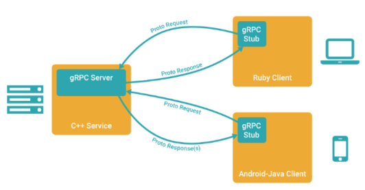

# gRPC笔记
在 gRPC 里客户端应用可以像调用本地对象一样直接调用另一台不同的机器上服务端应用的方法，能够更容易地创建分布式应用和服务。




**gRPC基于以下理念**：
    定义一个服务，指定其能够被远程调用的方法（包含参数和返回类型）。
    在服务端实现这个接口，并运行一个 gRPC 服务器来处理客户端调用。
    在客户端拥有一个存根能够像服务端一样的方法。

## protocol buffers：
gRPC 默认使用 protocol buffers 结构数据序列化机制（当然也可以使用其他数据格式如 JSON）
protocol buffers通过.proto文件定义服务。

一个 RPC 服务通过参数和返回类型来指定可以远程调用的方; gRPC 通过 protocol buffers 接口定义语言来定义服务方法(定义参数和返回类型), 客户端和服务端均使用服务定义生成的接口代码.

**gRPC tools**
Python的gRPC工具包括protocol buffers编译 和从.proto服务定义生成服务器和客户端代码的插件。
```
python -m pip install grpcio-tools
```

**生成 gRPC code**
根据helloworld.proto定义的服务生成客户端和服务端代码（helloworld_pb2.py和 helloworld_pb2_grpc.py）。
```
python -m grpc_tools.protoc -I./protos --python_out=./out_dir --grpc_python_out=. ./protos/helloworld.proto
```

# 示例 helloworld
## 1. 使用.proto文件定义服务
"helloworld.proto"
```proto3
syntax = "proto3";

option java_package = "io.grpc.examples";

package helloworld;

// 服务定义
service Greeter {
  rpc SayHello (HelloRequest) returns (HelloReply) {}
}

// 请求消息
message HelloRequest {
  string name = 1;
}

// 响应消息
message HelloReply {
  string message = 1;
}
```

## 2. 根据.proto文件生成grpc调用相关代码
```
python -m grpc_tools.protoc -I./protos --python_out=./out_dir --grpc_python_out=. ./protos/helloworld.proto
```
"helloworld.proto" ==> "elloworld_pb2.py"和 "helloworld_pb2_grpc.py"

"helloworld_pb2_grpc.py"中定义了提供gRPC服务和注册gRPC服务相关的类,方法和对象 -- 对应.proto文件中的service定义。
```
GreeterServicer, GreeterStub -- 用于提供gRPC服务(分别对应服务端类 与客户端类)
add_GreeterServicer_to_server --用于注册gRPC服务
```

"helloworld_pb2.py"中定义了gRPC需要的相关消息 -- 对应.proto文件中的message定义
```
HelloRequest， HelloReply
```

## 3. 编写服务端代码
实现.proto中定义的service. 并完成服务注册.

```python ['greeter_server.py']
from concurrent import futures
import logging

import grpc
import helloworld_pb2
import helloworld_pb2_grpc

class Greeter(helloworld_pb2_grpc.GreeterServicer): # 父类来自"helloworld_pb2_grpc.py"
    
    # 重写父类方法(reques是HelloRequest的实例)
    def SayHello(self, request, context): 
        return helloworld_pb2.HelloReply(message='Hello, %s!' % request.name)


def serve():
    server = grpc.server(futures.ThreadPoolExecutor(max_workers=10))
    helloworld_pb2_grpc.add_GreeterServicer_to_server(Greeter(), server) # 注册gRPC服务
    server.add_insecure_port('[::]:50051') # 请求端口
    server.start()
    server.wait_for_termination()


if __name__ == '__main__':
    logging.basicConfig()
    serve()
```

## 4. 编写客户端代码
```python ['greeter_client.py']
import grpc
import helloworld_pb2
import helloworld_pb2_grpc

def run():
    with grpc.insecure_channel('localhost:50051') as channel: # 在指定端口上请求远程调用
        stub = helloworld_pb2_grpc.GreeterStub(channel) # 通过Stub进行远程调用
        response = stub.SayHello(helloworld_pb2.HelloRequest(name='you'))
    print("Greeter client received: " + response.message)


if __name__ == '__main__':
    logging.basicConfig()
    run()
```


### 测试
启动服务
python greeter_server.py
客户端调用
python greeter_client.py


