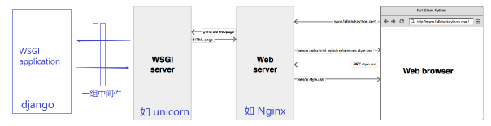
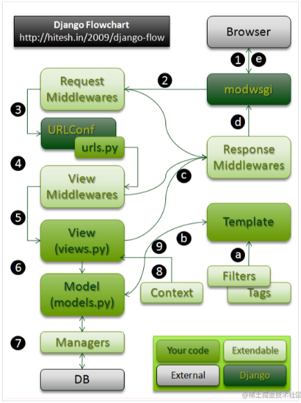
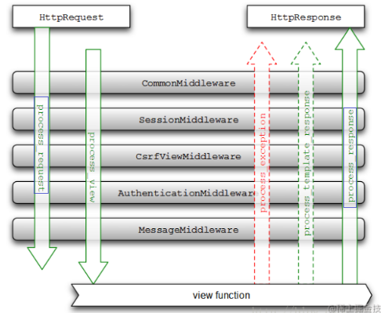

# django(基于WSGI的)
django启动时，启动了一个WSGIserver以及为每个请求的用户生成一个handler。
理解WSGI协议; WSGIHandler这个类控制整个请求到响应的流程，以及整个流程的基本过程.
参考: https://juejin.cn/post/6844903556416274446
        https://www.jianshu.com/p/679dee0a4193



## 请求到响应的过程
**大致几个步骤**：

1. 用户通过浏览器请求一个页面  
2. 请求到达Request Middlewares，中间件对request做一些预处理或者直接response请求  
3. URLConf通过urls.py文件和请求的URL找到相应的View  
4. View Middlewares被访问，它同样可以对request做一些处理或者直接返回response  
5. 调用View中的函数  
6. View中的方法可以选择性的通过Models访问底层的数据  
7. 所有的Model-to-DB的交互都是通过manager完成的  
8. 如果需要，Views可以使用一个特殊的Context  
9. Context被传给Template用来生成页面  
    a.Template使用Filters和Tags去渲染输出  
    b.输出被返回到View  
    c.HTTPResponse被发送到Response Middlewares  
    d.任何Response Middlewares都可以丰富response或者返回一个完全不同的response  
    e.Response返回到浏览器，呈现给用户  

## 中间件
作用于Web服务器端和Web应用之间.
在django中，中间件能够帮我们准备好request这个对象，也帮我们在response添加头部，状态码等.
每个中间件类至少含有以下四个方法中的一个：
process_request、 process_view、process_exception、process_response
**中间件处理顺序**



# 脚手架
1. 创建django项目: `django-admin startproject mysite`
2. 创建django应用（一个项目必须包含一个或多个应用）: `python manage.py startapp appName`
3. 运行开发服务器: `python manage.py runserver`
4. django AIP测试: `python manage.py shell`

设置 DJANGO_SETTINGS_MODULE 环境变量，这个变量会让 Django 根据 mysite/settings.py 文件来设置 Python 包的导入路径。
django框架中request.body是bytes类型的，需要进行decode.

# 数据库表迁移
参考:
[django初识](https://docs.djangoproject.com/zh-hans/3.2/intro/overview/#)
[migrations](https://docs.djangoproject.com/zh-hans/3.2/topics/migrations)
1. makemigrations查找所有可用的模型，为任意一个在数据库中不存的对应数据表的模型创建迁移脚本文件
`python manage.py makemigrations`
会在对应的app生成数据库迁移相关的文件 (XXXX_initial.py)
2. sqlmigrate 展示迁移使用的SQL语句：`python manage.py sqlmigrate app_label migration_name`
app_label: 对应django中的app名称
migration_name: 对应makemigrations命令生成文件的名称(可只输入前缀)
eg: `python manage.py sqlmigrate app001 0001`
3. migrate 命令 运行这些迁移来自动创建数据库表: `python manage.py migrate [app_label] [migration_name]`  （创建或修改表）

```
eg:
python manage.py showmigrations
python manage.py migrate --fake
python manage.py migrate django_celery_beat --fake
```

# 根据已有表生成ORM模型
[根据已有表生成ORM模型](https://blog.csdn.net/qq_42128241/article/details/101847121)
1. 数据库配置
```
DATABASES = {
    # oracle使用service_name时的连接方式. 应该把 HOST 和 PORT 都留空
    'default': {
        'ENGINE': 'django.db.backends.oracle',
        'NAME': r"{db_cfg['HOST']}:{db_cfg['PORT']}/{db_cfg['SERVER_NAME']}",
        'USER': db_cfg['USERNAME'],
        'PASSWORD': db_cfg['PASSWORD'],
        'HOST': '',
        'PORT': '',
        'OPTIONS': {
            'use_returning_into': False,
        }
    }
}
```
2. 从已有表生成model （注： 自动生成的model需要手动修正）
* 生成全部表对应的model: `python manage.py inspectdb > models.py`
* 对指定数据库表生成model: `manage.py inspectdb [--database DATABASE] table1 table2 ...`
3. 修正模型: 新生成的ORM模型有些地方可能不太适合使用。 比如模型的名字，表之间的关系等等， 以下选项需要重新配置：
* 模型名(class name): 自动生成的模型是根据表的名字生成的，可能不是你想要的。
* 模型外键引用: 将所有使用Foreignkey的地方，模型引用都改成字符串。 这样不会产生模型顺序的问题。 另外，如果引用的模型已经移动到其他app中了，那么还要加上这个app的前缀。
* 让django管理模型：将Meta下的managed=False改为True， 如果为Fasle那么以后这个模型有任何的修改，使用migrate都不会映射到数据库中。
* 表名： 切记不要修改表名(这里的表名是指 class Meta中的db_table), 不然映射到数据库中，会发生找不到对应表的错误。
4. 执行命令`python manage.py makemigrations`生成初始化的迁移脚本。方便后面通过ORM来管理表。 这时候还需要执行命令`python manage.py migrate --fake-initial`, 因为如果不使用--fake-initial那么会将迁移脚本映射到数据库中， 这时候迁移脚本会新建表，而这个表是之前已经存在的，所以会报错。 此时我们只要将0001-initial的状态修改为已经映射，而不是真正执行，下次再migrate的时候就会忽略它。
5. 将django的核心表映射到数据库中：django中还有那些核心表也是需要创建的。 不然有些功能用不了。 比如auth相关表。 如果数据库之前就是使用django开发的，那么这些表已经存在了，可以不用管。如果之前这个数据库不是使用django开发的，那么应该使用`python manage.py migrate`命令将django中的核心模型映射到数据库中。 


# model create
```
from reports.models import RTaskStatistical
data = {"TASK_STATUS": 'running'}
# create会在表中插入一条记录，但如果进行了修改则需要再save
ts_obj = RTaskStatistical.objects.create(**data)  # 此时会在表中插入一条记录
ts_obj.TASK_START_TIME = now()
ts_obj.save()  # 如果不save，则修改的字段不会保存到表中
```

# pk & id
```
from django.db import models
class TestG(models.Model):
    NAME = models.CharField(max_length=255, blank=True, null=True)
    # ID = models.FloatField(blank=True, null=True)  # 情况I
    # ID = models.FloatField(primary_key=True)  # 情况II
    # P_ID = models.FloatField(primary_key=True)  # 情况III
   
    class Meta:
        managed = False
        db_table = 'test_gj'
```
1. model中无ID字段，此时`self.pk is self.id`
-- 因为默认情况下, Django为每个模型提供以下字段 id = models.AutoField(primary_key=True)
此时若表中无对应的id字段，刚save会报错"django.db.utils.DatabaseError: ORA-00904: TEST_G.ID： invalid identifier"
2. 有'作为非主键的ID字段'时(情况I), 可正常save, 此时`self.pk is self.ID`
3. 有'作为主键的ID字段'时(情况II), 可正常save， 此时`self.pk is self.ID`
4. 有'主键字段且字段名称非ID'时(情况III), 可正常save， 此时`self.pk is self.P_ID`
**结论**：有主键时self.pk即主键字段别名，无主键但有ID字段时,self.pk即ID别名；django不允许无主键也无ID字段。

# 问题记录
## Django: Cannot update a query once a slice has been taken
Django一旦切片被取消，就无法更新查询
 [参考](https://www.zhihu.com/question/57861389?sort=created)
 
 ```
a.objects.filter(a=1).[:30].update(b=2) # error
# 可以修改为如下
a_obj=a.objects.filter(a=1).[:30]
a.object.filter(pk__in=list(a_obj)).update(b=2)
```