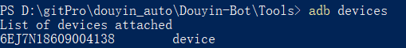
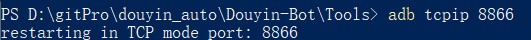
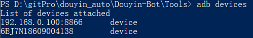
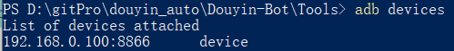

# Android ADB调试之无线连接设备
0. 手机和电脑连接同一个Wi-Fi
1. 华为手机设置
1.1 设置->系统->关于手机->版本号7连击->上层目录会出现开发者选项
1.2 开发人员选项  -> USB调试 -> 监控ADB安装应用 ->仅充电 模式下允许ADB调试 ->选择USB配置(仅充电)
2. Android无线调试设置
2.1 "adb devices" 查看当前可以连接到adb 的设备

2.2 为手机设置侦听端口号 "adb tcpip 侦听端口号"（eg:8866）
(多手机调试设置端口号 "adb -s 设备号 tcpip 侦听端口号")
adb tcpip 8866

2.3 查看手机的ip地址
按着已连接的wifi，修改网络，查看无线网静态ip

2.4 执行 "adb connect ip地址:侦听端口号"，开启无线连接

adb connect 192.168.0.100:8866

2.5 输入adb devices，得到以下提示说明连接成功

2.6 拔掉数据线，再执行1正常，说明无线调试连接成功

2.7 断开连接
adb disconnect 192.168.0.100:8866

**注意事项**：
1、连接成功之后，不论是手机还是电脑，如果中间出现了断网现象（比如，重启手机，重启电脑，重启路由器等），需要重新走一遍流程 
2、由于网络防火墙或者网络代理等因素，无线连接可能不会成功 
3、连接不成功时，可以尝试通过 adb kill-server 杀死 adb 服务，然后再次走一遍流程
