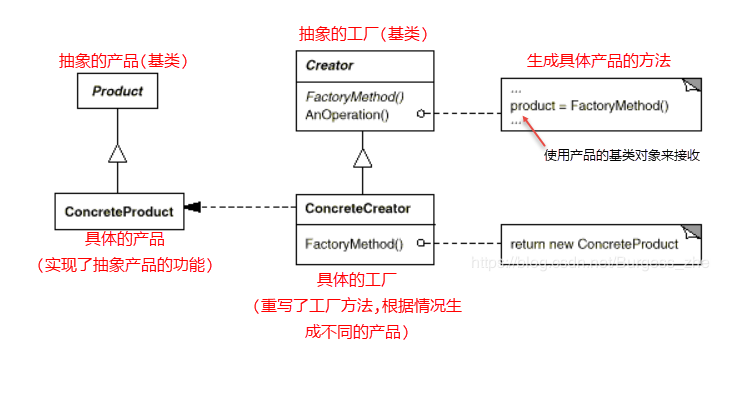
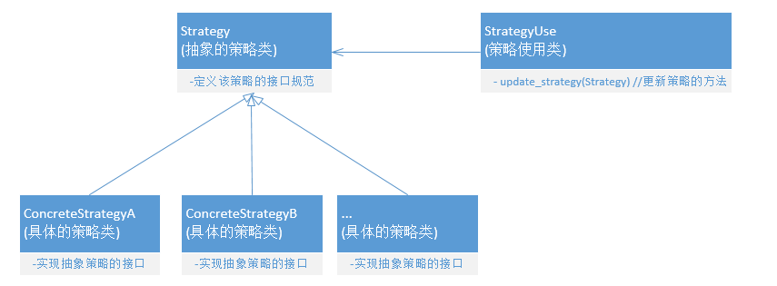
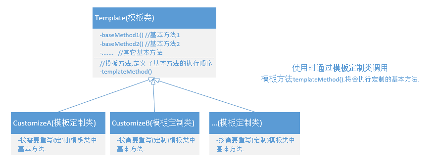
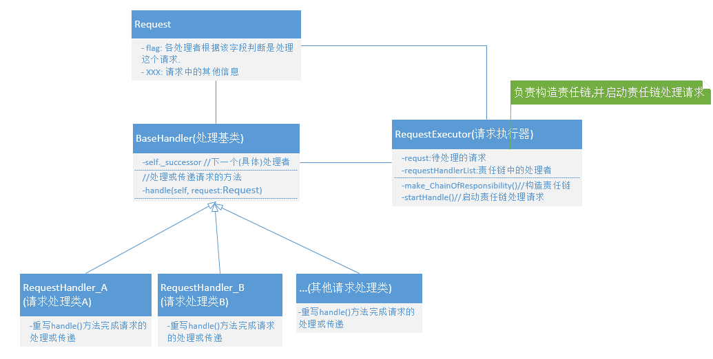
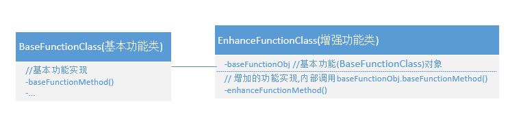

# 常用设计模式
设计模式很多,不要着急全学,先学会工作中常用的几种:
## 工厂模式(Factory)
### 作用：
使用一致的接口来控制对象的创建．
### 类图：


### 简单工厂模式(Simple Factory) VS 工厂方法模式(Factory Method)
+ 简单工厂模式(Simple Factory)
  - 在实现时，去掉上图中的"抽象工厂"类(Creator),只实现一个工厂类，所以产品都通过这一个工厂类生成．
  - 在需要创建新的产品时要做的操作：
    * 需要新增一个"具体的产品"类(继承自"抽象的产品"类)
    * 需要修改"具体工厂"类中的工厂方法(如：添加if分支，针对场景生成新的产品)．

+ 工厂方法模式(Factory Method)
  - 在实现时，需要创建上图中的"抽象工厂"类(Creator),并为每一个产品创建一个对应的工厂类，每个工厂类只负责对应产品的创建．
  - 在需要创建新的产品时要做的操作：
    * 需要新增一个"具体的产品"类(继承自"抽象产品"类)
    * 需要新增与新增的产品对应的"工厂"类(继承自"抽象工具"类)
 + 对比:
工厂方法模式是简单工厂模式的衍生，工厂方法模式实现‘开－闭 原则’. 工厂方法模式比简单工厂模式,多了一个抽象的工厂类，这个类将不在负责具体的产品生产，而是只制定一些规范，具体的生产工作由其子类去完成。在这个模式中，工厂类和产品类往往可以依次对应。即一个抽象工厂对应一个抽象产品，一个具体工厂对应一个具体产品，这个具体的工厂就负责生产对应的产品。 　　
工厂方法模式(Factory Method pattern)是最典型的模板方法模式(Templete Method pattern)应用。


### 简单工厂模式(Simple Factory)代码示例
```
#!/usr/bin/env python 
#-*- coding:utf-8 -*-
# 抽象"产品"
class Product_Shape(object):
    def draw(self):
        raise NotImplementedError
# 具体"产品1"
class ConcreteProduct_Circle(Product_Shape):
    def draw(self):
        print('draw circle')
# 具体"产品2"
class ConcreteProduct_Rectangle(Product_Shape):
    def draw(self):
        print('draw Rectangle')
        
# 工厂类
# 注: 简单工厂模式不同对象的生成全在一个工厂类中完成
class ConcreteFactory_ShapeFactory(object):
    # 工厂方法 --FactoryMethod
    def create(self, shape):
    　　# 根据情况生成不同的具体"产品"对象
        if shape == 'Circle':
            return ConcreteProduct_Circle()
        elif shape == 'Rectangle':
            return ConcreteProduct_Rectangle()
        else:
            return None
       
if __name__ == "__main__":
    # 使用
    fac = ConcreteFactory_ShapeFactory()
    obj = fac.create('Circle')     # 工厂方法根据场景创建产品
    obj2 = fac.create('Rectangle') # 工厂方法根据场景创建产品
```

### 工厂方法模式(Factory Method)代码示例
```
#!/usr/bin/env python
#-*- coding:utf-8 -*-

# 抽象产品类 --定义该类产品的共性
class Product_Shape(object):
    def getShape(self):
        return self.shape_name
        
# 具体"产品1"
class ConcreteProduct_Circle(Product_Shape):
    def __init__(self):
        self.shape_name = "Circle"
    def draw(self):
        print('draw circle')
        
# 具体"产品2"
class ConcreteProduct_Rectangle(Product_Shape):
    def __init__(self):
        self.shape_name = "Retangle"
    def draw(self):
        print('draw Rectangle')
 
# 抽象工厂类--定义对Shape类产品的创建规范
class Factory_Shape(object):'
    def create(self):
        raise  NotImplementedError
        
# 具体工厂类1--实现抽象工厂中的规范(对Shape特定子类产品(ConcreteProduct_Circle)的创建)
class ConcreteFactory_Circle(Factory_Shape):
    def create(self):
        return ConcreteProduct_Circle()
 
# 具体工厂类2
class ConcreteFactory_Rectangle(Factory_Shape):
    def create(self):
        return ConcreteProduct_Rectangle()
 
if __name__ == "__main__":
    # 使用
    shape_interface = ConcreteFactory_Circle()　# 使用与产品对应的工厂来创建产品
    obj = shape_interface.create()
    obj.getShape()
    obj.draw()
     
    shape_interface2 = ConcreteFactory_Rectangle()
    obj2 = shape_interface2.create()
    obj2.draw()
```

## 策略模式(Strategy)
### 作用：
可替换的积木群．这些积木以相同的接口实现了不同的(或许类似的)功能，在需要的情况下这些积木可以相互替换．
### 类图


### 策略模式(Strategy)代码示例

```
# !/usr/bin/env python
# -*- coding:utf-8 -*-
# 抽象的策略类(定义策略接口规范)
class Strategy_Travel(object):　# 出行策略
    def travelAlgorithm(self):
        raise NotImplementedError
        
# 具体的策略类1(实现了策略接口)
class ConcreteStrategy_Airplane(Strategy_Travel):　# 飞机出行
    def travelAlgorithm(self):
        print("坐飞机出行....")
        
# 具体的策略类2
class ConcreteStrategy_Train(Strategy_Travel): # 高铁出行
    def travelAlgorithm(self):
        print("坐高铁出行....")
 
# 具体的策略类3
class ConcreteStrategy_Car(Strategy_Travel): # 自驾出行
    def travelAlgorithm(self):
        print("自驾出行....")
 
# 使用策略的类
class UseStrategy_Travel(object):
    def __init__(self,travel_strategy):
        self.travel_strategy = travel_strategy
        
    # 定义具体使用何种策略
    def update_strategy(self,travel_strategy):
        self.travel_strategy = travel_strategy
    def travel(self):
        return self.travel_strategy.travelAlgorithm()
 
if __name__ == "__main__": 
    # 使用策略模式
    travel = UseStrategy_Travel(ConcreteStrategy_Airplane())　# 坐飞机
    travel.travel()
     
    travel.update_strategy(ConcreteStrategy_Car())　# 改开车
    travel.travel()
```
## 模板方法(Template Method)
### 作用
TemplateMethod 使得子类可以不改变一个算法的结构即可重定义该算法的某些特定步骤。
一次性实现一个算法的不变的部分，并将可变的行为留给子类来实现．
模板方法模式一种行为型设计模式，在抽象父类中提供一个模板方法来定义基本方法的执行次序，子类可通过重写基本方法，在不改变基本方法的执行次序的情况下修改某些基本方法的行为．
总的来说：模板方法模式提供了一个模板方法来定义算法框架，而某些具体步骤的实现可以在其子类中完成。
### 类图

### 模板方法(Template Method)代码示例
```
#!/usr/bin/env python 
#-*- coding:utf-8 -*-
# 模板类: 用户注册时的通用操作(模板)
class TemplateForRegister(object):
    def register(self): # 基本方法
        # raise NotImplementedError
        pass
    def login(self): # 基本方法
        # raise NotImplementedError
        pass
        
 　　# 模板方法. 定义了基本方法的执行顺序
    def auth(self):
        self.register()
        self.login()

# 模板子类, 定制模板中的基本方法行为
class RegisterByQQ(TemplateForRegister):
    def register(self):
        print("---用qq注册-----")
 
    def login(self):
        print('----用qq登录-----')
 
 # 模板子类, 定制模板中的基本方法行为
class RegisterByWeiChat(TemplateForRegister):
    '''微信注册'''
 
    def register(self):
        print("---用微信注册-----")
 
    def login(self):
        print('----用微信登录-----')
 
 
if __name__ == "__main__":
    register1 = RegisterByQQ()
    register1.login()　# 调用模板方法
 
    register2 = RegisterByWeiChat()
    register2.login()　# 调用模板方法
```
## 责任链模式(Chain of Responsibility)
### 作用
将需要处理请求的对象连成一条链，使请求沿着这条传递，这样就使多个对象都能有机会处理该请求(何时停止请求的传递可以由程序进行控制)，避免了发送者与接收者之间的耦合．
### 类图

### 责任链模式代码示例
```python
#!/usr/bin/env python
#-*- coding:utf-8 -*-

# 请求
class Request(object):
    def __init__(self, permission, event):
        self.permission = permission # 权限
        self.event = event           # 事件

# 责任链处理者基类
class BaseHandler(object):
    def __init__(self):
        self._successor = None
    # 设置下一个处理者
    def successor(self, successor):
        self._successor = successor
    def handle(self, request:Request):
        raise NotImplementedError
        
# 责任链处理者类
class RequestHandler_A(BaseHandler):　# 请求处理者A
    name = "操作员nameA"
    def handle(self,　request:Request):
        if request.permission == 'A' :
            print("[%s]有权限处理该请求[%s],请求不再往下传递"%(self.name, request.event))
        elif self._successor:
            print("[%s]无权限处理该请求[%s],请求往下传递"%(self.name, request.event))
            self._successor.handle(request) # 把请求传递给下一个处理者处理
        else:
            print("没有下一个处理者，终止请求传递")
            
# 责任链处理者类
class RequestHandler_B(BaseHandler): # 请求处理者B
    name = "操作员nameB"
    def handle(self,request:Request):
        if request == 'B' :
            print("[%s]有权限处理该请求[%s],请求不再往下传递"%(self.name, request.event))
        elif self._successor:
            print("[%s]无权限处理该请求[%s],请求往下传递"%(self.name, request.event))
            self._successor.handle(request) # 把请求传递给下一个处理者处理
        else:
            print("没有下一个处理者，终止请求传递")
            
# 责任链处理者类
class RequestHandler_C(BaseHandler): # 请求处理者C
    name = "操作员nameC"
    if request == 'C' :
            print("[%s]有权限处理该请求[%s],请求不再往下传递"%(self.name, request.event))
        elif self._successor:
            print("[%s]无权限处理该请求[%s],请求往下传递"%(self.name, request.event))
            self._successor.handle(request) # 把请求传递给下一个处理者处理
        else:
            print("没有下一个处理者，终止请求传递")
 
# 请求执行器
class RequestExecutor(object):
    def __init__(self, permission, event):
        self.request = Request(permission, event)
        # 初始化责任链处理者
        handlerA = RequestHandler_A()
        handlerB = RequestHandler_B()
        handlerC = RequestHandler_C()
        _make_ChainOfResponsibility([handlerA, handlerB, handlerC])

    # 构造责任链--将各级处理者串接起来
 　 # requestHandlerList: 按处理请求的先后顺序排列的处理者列表
    def _make_ChainOfResponsibility(self, requestHandlerList:list[BaseHandler]):
        chainLen = len(requestHandlerList)
        for i in range(chainLen):
            if i < chainLen-1:
                requestHandlerList[i].successor(requestHandlerList[i+1])
        self.requestHandlerList = requestHandlerList
    
    # 如果需要还可以动态添加和删除处理者
    def addRequestHandler(self, handler:BaseHandler):
        pass
    def removeRequestHandler(self, handler_index:int):
        pass

    # 统一请求接口
    def handle(self):
        if len(self.requestHandlerList) != 0:
            requestHandlerList[0].handle(self.request)
 
 
if __name__ == "__main__":
    executor = RequestExecutor('B', '审批50W')
    r1.handle()
    print(r1.__dict__)
```
## 装饰者模式(Decorator)

### 作用
以组合基本功能类的方式增加对象的功能。
### 类图

### 装饰者模式代码示例
```
#!/usr/bin/env python 
#-*- coding:utf-8 -*-

# 日志类
class BaseLog(object):
    def log(self, info):
        print(info)
 
# 强化的日志类，在Log类的基础上输出更多的信息
class EnhanceLog(object):
    def __init__(self, baseLog:BaseLog):
        self._baseLog = baseLog # 以组合的方式集成BaseLog的功能
 
    def log(self):
        print(" ")
        self._baseLog.log()
 
    def __getattr__(self, name):
        return getattr(self._baseLog, name)
 
if __name__ == "__main__":
    beseLog = BaseLog()
    log = EnhanceLog(beseLog)
    v.log()
```

* 注: 使用python自带的闭包功能和装饰器功能，可以很方便的实现装饰器模式。
```
import time
import functools

@enhanceLog # 用enhanceLog函数装饰log函数. 所以log <==> enhanceLog(log)
def log():
    print(time.strftime("%Y-%m-%d %H:%M:%S", time.localtime()))

def enhanceLog(func):
    @functools.wraps(func)
    def wrapper(*args, **kw):	 #定义wrapper，增强func的功能（返回func的调用结果）
        print('xxx功能增强xxx')
        return func(*args, **kw) 	#执行函数并返回结果
    return wrapper  #返回wrapper函数 ---可以理解为增加的func

if __name__ == "__main__":
    log()  
    # 此时存在如下等价关系:
    # log <==> enhanceLog(log)
    # 所以:log() <==> enhanceLog(log)() <==> enhanceLog.wrapper()
    # 注: 此时是通过基本功能函数执行，而不是通过增强后的函数执行
```