# 推荐相关知识
**推荐系统包含的环节:**
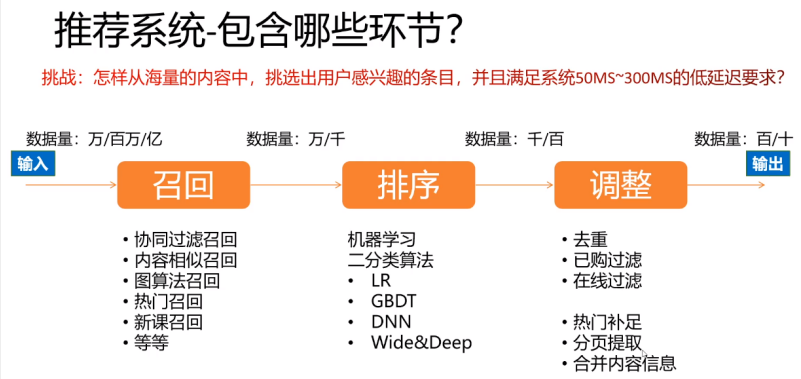

**推荐系统的召回路径:**
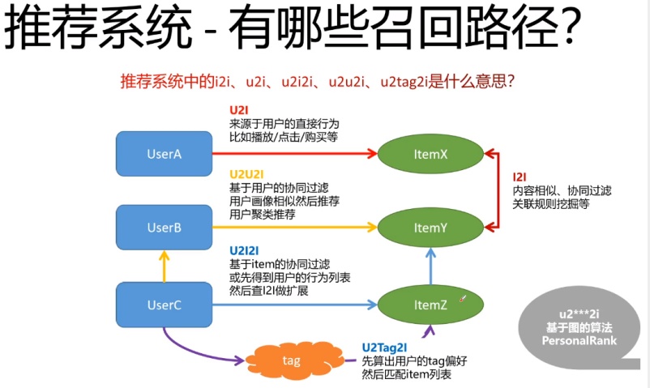

**Netflix经典推荐系统架构:**
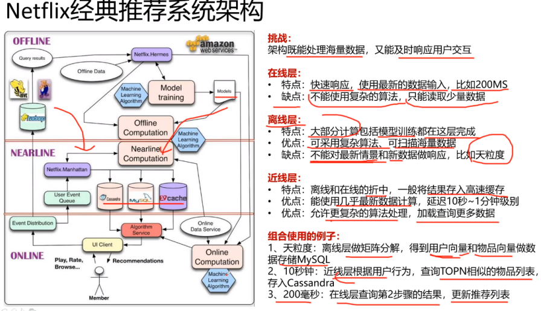


**CF:**
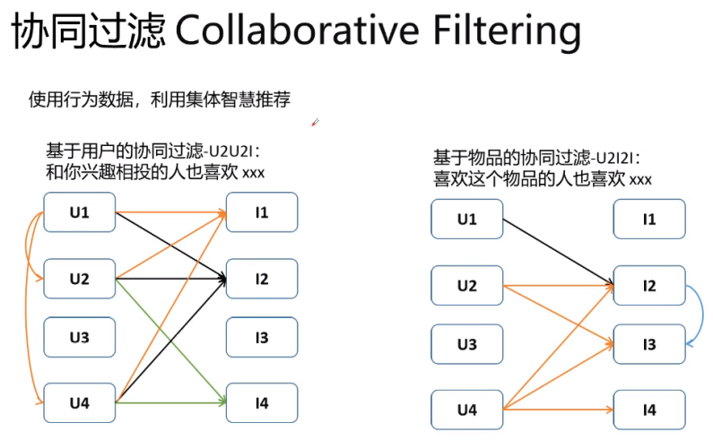

**API接口设计:**
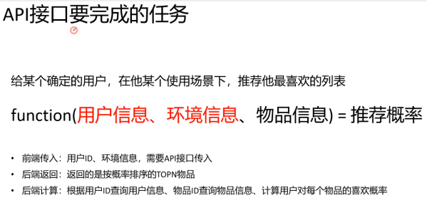

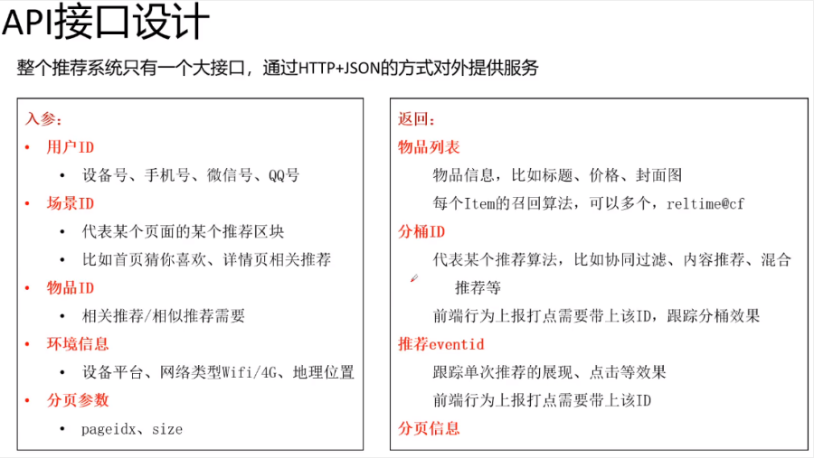
前端转入: 算法所需的信息
后端返回: 推荐列表，以及跟踪数据(用于进行评估)

# 传统CTR模型发展衍生图
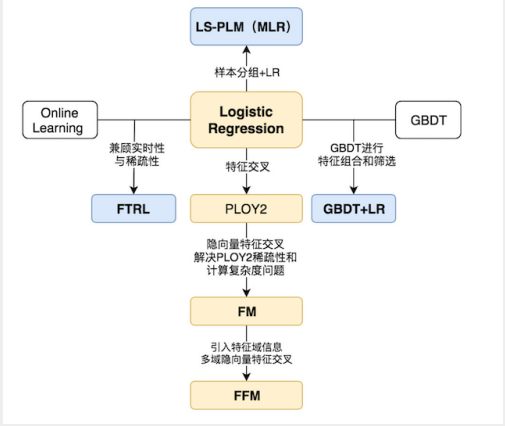
* 为了解决特征交叉的问题，演化出PLOY2，FM，FFM等模型；
* 使用模型化、自动化的手段解决之前特征工程的难题，Facebook将LR与GBDT进行结合，提出了GBDT+LR组合模型
* Google从online learning的角度解决模型时效性的问题，提出了FTRL
* 阿里基于样本分组的思路增加模型的非线性，提出了LS-PLM（MLR）模型

## LR
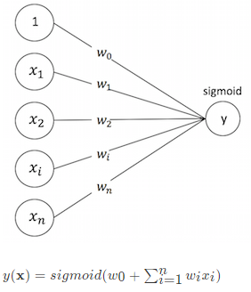


## FM(Factorization Machine) 隐向量特征交叉
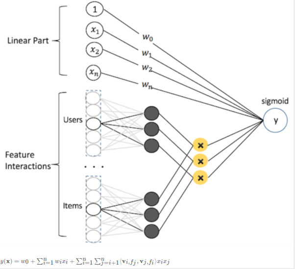


缺点：
考虑两两特征的全部组合时:
假设函数为:
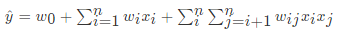
其中$\omega_{ij}$为组合特征的权重,$x_ix_j$为两两特征组合.
当特征维度n很高时,交叉项d^2将会有很多,每一个参数$\omega_{ij}$的学习过程需要大量的$x_i,x_j$同时非零的训练样本数据.

FM采用的解决方案：可以对$W_{n\times n}$进行矩阵分解$W_{n\times n}=V_{n\times k}V_{n\times k}^T$，即$w_{i,j}=< v_i, v_j >$. 
其中k≪n，本来需要训练的n×n个参数，现在只需要训练n×k个.

FM相当于在特征交叉中引入了隐变量，将特征$x_i$对其他特征$X_j$的组合，转换成$x_i$对隐变量$v_i$的组合与隐变量$v_i$对$X_j$的组合.


## GBDT+LR
特征工程模型化的开端.
Facebook提出了一种利用GBDT自动进行特征筛选和组合，进而生成新的离散特征向量，再把该特征向量当作LR模型输入，预估CTR的模型结构
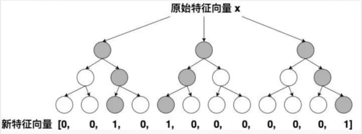


## 在线优化算法-Online-learning
Online Learning并不是一种模型，而是一种模型的训练方法，Online Learning能够根据线上反馈数据，实时快速地进行模型调整，使得模型及时反映线上的变化，提高线上预测的准确率.
Online Learning并不是一种模型，而是一种模型的训练方法.
Online Learning的流程包括：将模型的预测结果展现给用户，然后收集用户的反馈数据，再用来训练模型，形成闭环的系统

### FTRL(Follow-the-regularized-Leader)
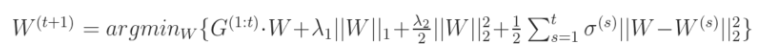

#### 正则化(Regularization)
在损失函数中加入一个正则化项(惩罚项)，惩罚模型的复杂度，防止网络过拟合

**L1与L2正则化**
逻辑回归的参数W数量根据特征的数量而定，那么正则化如下
* 逻辑回归的损失函数中增加L2正则化
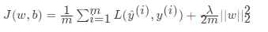
* 逻辑回归的损失函数中增加L1正则化
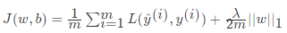

* PS: 其中，λ 为正则化因子，是超参数。由于 L1 正则化最后得到 w 向量中将存在大量的 0，使模型变得稀疏化，因此 L2 正则化更加常用

正则项：目标函数添加L1正则项可增加模型解的稀疏性，添加L2正则项有利于防止模型过拟合。也可以将两者结合使用，即混合正则，FTRL就是这样设计的。


特征预处理
* 特征归一化：深度网络的学习几乎都是基于反向传播，而此类梯度优化的方法对于特征的尺度非常敏感。因此，需要对特征进行归一化或者标准化以促使模型更好的收敛。
* 特征离散化:工业界一般很少直接使用连续值作为特征，而是将特征离散化后再输入到模型中。一方面因为离散化特征对于异常值具有更好的鲁棒性，其次可以为特征引入非线性的能力。并且，离散化可以更好的进行Embedding，我们主要使用如下两种离散化方法：
  * 等频分桶：按样本频率进行等频切分，缺失值可以选择给一个默认桶值或者单独设置分桶。
  * xxx
* 特征组合：基于业务场景对基础特征进行组合，形成更丰富的行为表征，为模型提供先验信息，可加速模型的收敛速度。如：用户性别与类目之间的交叉特征,时间与类目之间的交叉特征
* 多考虑Embedding:通过Embedding去表征用户的个性化偏好和商户的精准画像
* 增加模型的DNN层级也会增加效果


# 深度学习CTR排序模型
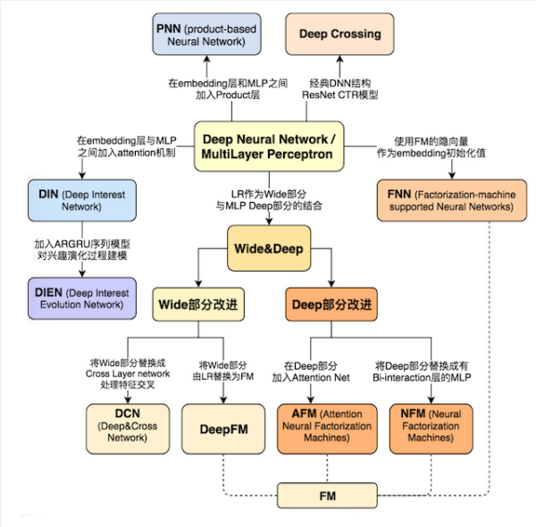

我们在学习使用一些广告、推荐领域流行的深度学习CTR模型的结构特点时候。应当选择模型的标准尽量遵循下面三个原则：
1. 模型的在业界影响力较大的
2. 已经被Google，微软，阿里等知名互联网公司成功应用的
3. 工程导向的，而不是仅用实验数据验证或学术创新用的


## Google Wide&Deep（2016年）记忆能力和泛化能力的综合权衡:
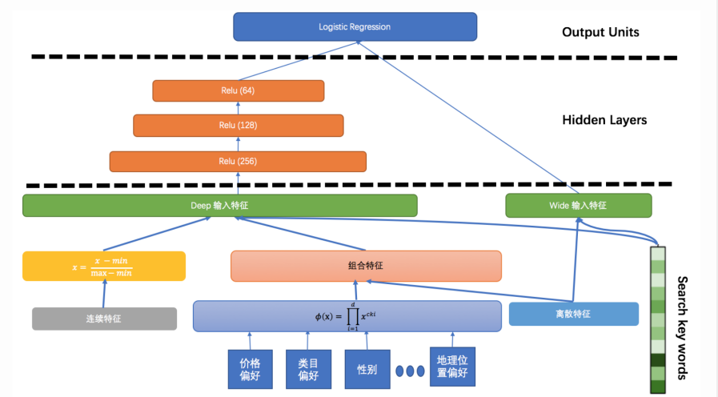

+ 其中Wide部分可以很好地学习样本中的高频部分，在LR中使用到的特征可以直接在这个部分使用，但对于没有见过的ID类特征，模型学习能力较差，同时合理的人工特征工程对于这个部分的表达有帮助。
  - 根据人工经验、业务背景，将我们认为有价值的、显而易见的特征及特征组合，喂入Wide侧。
+ Deep部分可以补充学习样本中的长尾部分，同时提高模型的泛化能力。Wide和Deep部分在这个端到端的模型里会联合训练。
  - 通过embedding将tag向量化，变精确匹配为tag向量的模糊查找，使自己具备了良好的“扩展”能力。

estimator = tf.estimator.DNNLinearCombinedClassifier()
* model_dir="",
* linear_feature_columns=wide_columns # 接受任何类型的特征列
* dnn_feature_columns=deep_columns    # 只接受密集列
* dnn_hidden_units=[]:dnn层的网络结构  # 只接受密集列


## 阿里DIN（2018年）阿里加入Attention机制的深度学习网络
pass

# TF Serving模型服务
TF Serving是TensorFlow官方提供的一套用于在线实时预估的框架.
使用TF serving可以快速支持RNN、LSTM、GAN等多种网络结构，而不需要额外开发代码。这非常有利于我们模型快速实验和迭代。


## SavedModel
导出savedmodel的模型格式.
TensorFlow有很多种模型格式，针对不同场景可以使用不同的格式，只要符合规范的模型都可以轻易部署到在线服务或移动设备上。
+ Checkpoint： 用于保存模型的权重，主要用于模型训练过程中参数的备份和模型训练热启动。
  只给 checkpoint 模型不提供代码是无法重新构建计算图的，需要运行代码加载模型训练或者测试
+ SavedModel：使用saved_model接口导出的模型文件
  包含模型Graph和checkpoint可直接用于上线，TensorFlowestimator和Keras模型推荐使用这种模型格式。
  - GraphDef(*.pb)：这种格式文件包含 protobuf 对象序列化后的数据，包含了计算图，可以从中得到所有运算符（operators）的细节，也包含张量（tensors）和 Variables 定义，但不包含 Variable 的值，因此只能从中恢复计算图，但一些训练的权值仍需要从 checkpoint 中恢复。


实现：
```
# 定义导出模型的输入特征列
columns = [tf.feature_column.categorical_column_with_identity('featureName1', num_buckets=25), ...]
# 模型的特征列输入函数指定，按照example构造
feature_spec = tf.feature_column.make_parse_example_spec(columns)
serving_input_receiver_fn = tf.estimator.export.build_parsing_serving_input_receiver_fn(feature_spec)
estimator.export_savedmodel("./serving_model/modelName/", serving_input_receiver_fn) # 只需要指定保存模型的路径即可
```

## TensorFlow Serving模型部署
使用Docker部署:
1. TensorFlow Serving Docker:
    docker pull tensorflow/serving
2. 查看docker镜像:
    docker images
3. 运行tf serving（即创建一个docker容器来运行）:
    docker run -p 8501:8501 -p 8500:8500 --mount type=bind,source=/home/ubuntu/detectedmodel/commodity,target=/models/commodity -e MODEL_NAME=commodity -t tensorflow/serving
    说明：
    * -p 指定端口映射:
      -p 主机端口:docker容器程序使用的端口.
      tf serving 使用8501端口对外提供HTTP服务，使用8500对外提供gRPC服务，这里同时开放了两个端口的使用
    * --mount 指定文件映射: 
      --mount type=bind, source=/pathA/modelName, target=/pathB/modelName: 将主机(source)的模型文件映射到docker容器程序（target)的位置，以便tf serving使用模型
    * -e 设置环境变量:
      -e MODEL_NAME=modelName: 设置一个名为MODEL_NAME的环境变量，此变量被tf serving读取，用来按名字寻找模型，与上面target参数中我的模型对应
    * -t 创建一个伪终端，供程序运行
    * tensorflow/serving: 镜像名


## 编写tf serving客户端程序调用serving模型服务，进行在线预测
1. 模型服务调用对接
  使用 grpc.insecure_channel('localhost:port') 对服务端对接,接着在这个channel 上创建 stub
  导入包：
    from tensorflow_serving.apis import prediction_service_pb2_grpc # 与grpc建立stub
```

example1 = tf.train.Example(features=tf.train.Features(feature={
                "featureName1": tf.train.Feature(int64_list=tf.train.Int64List(value=[featureName1])),
                "featureName2": tf.train.Feature(float_list=tf.train.FloatList(value=[featureName2]))),
            }))

examples = [example1, ...]

with grpc.insecure_channel('127.0.0.1:8500') as channel:
    stub = prediction_service_pb2_grpc.PredictionServiceStub(channel)

    # 获取测试数据集，并转换成 Example 实例
    # 准备 RPC 请求，指定模型名称。
    request = classification_pb2.ClassificationRequest()
    request.model_spec.name = 'wdl'
    request.input.example_list.examples.extend(examples)

    # 获取结果
    response = stub.Classify(request, 10.0)
    print(response)
```


## **推荐常用模型结构图**
### FM:
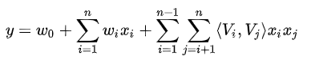

### FFM:
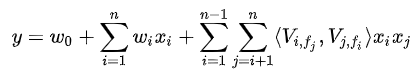

### FNN:
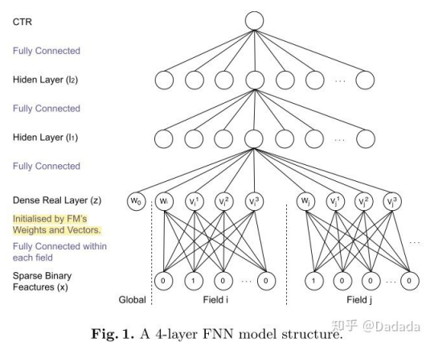


### PNN:
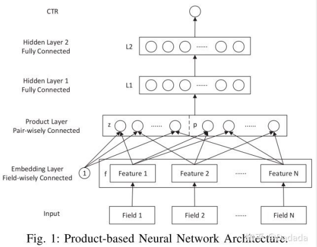


### DeepCrossing
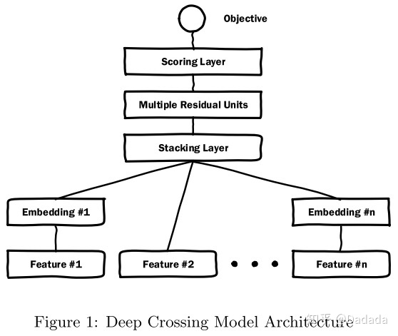

### Wide&Deep
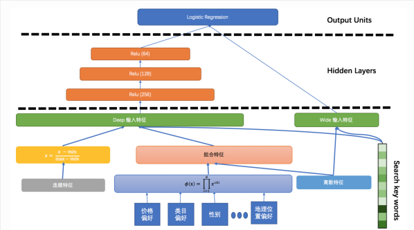
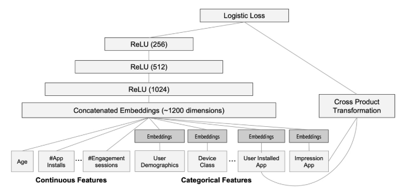

### DeepFM
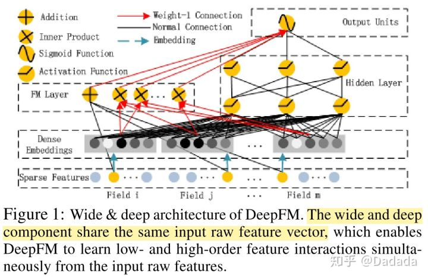


