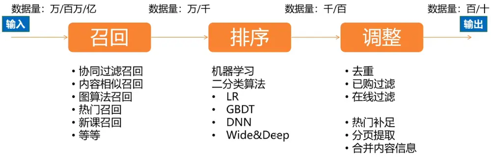
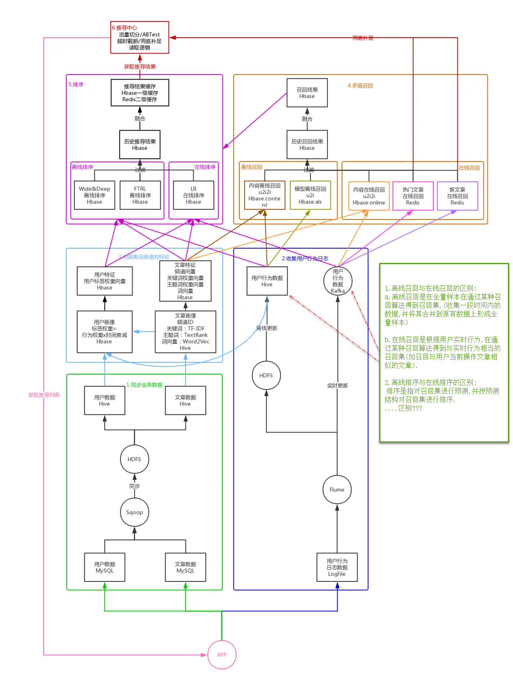
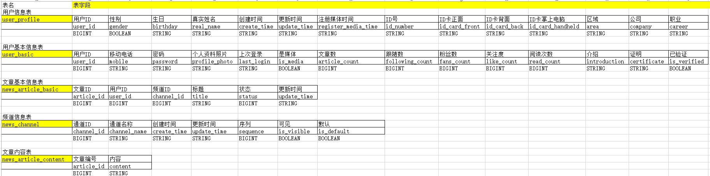
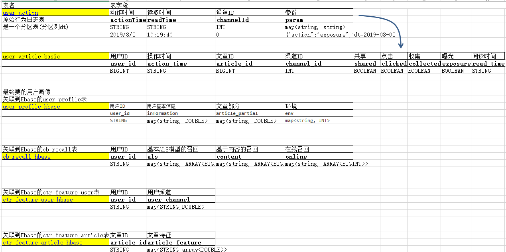
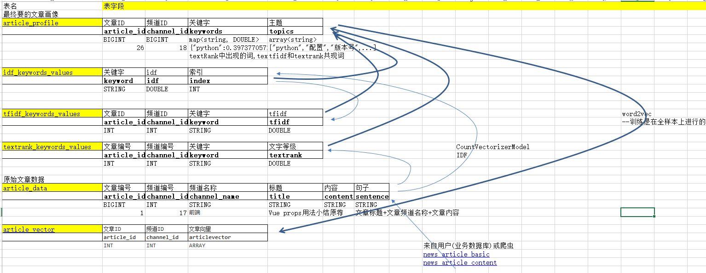
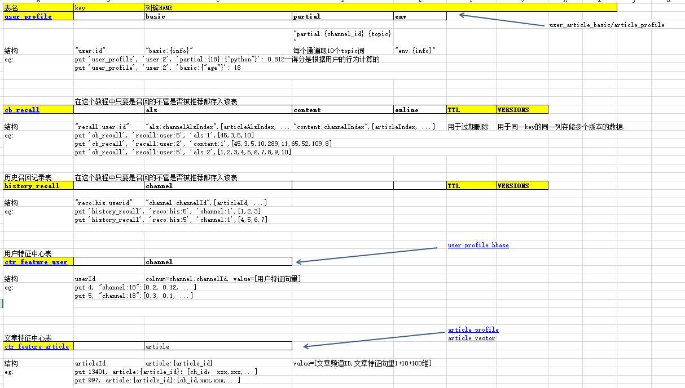
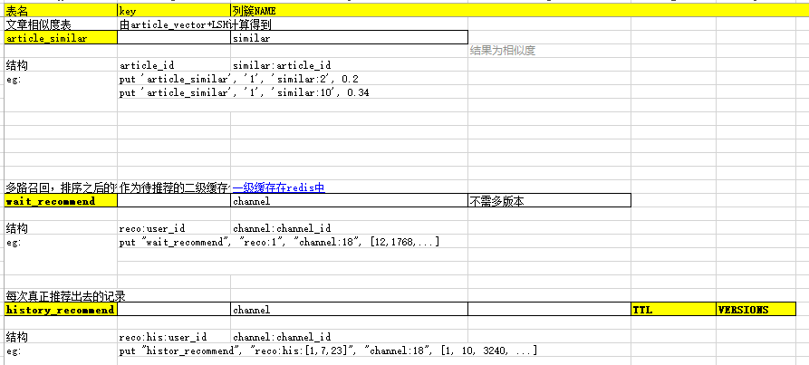
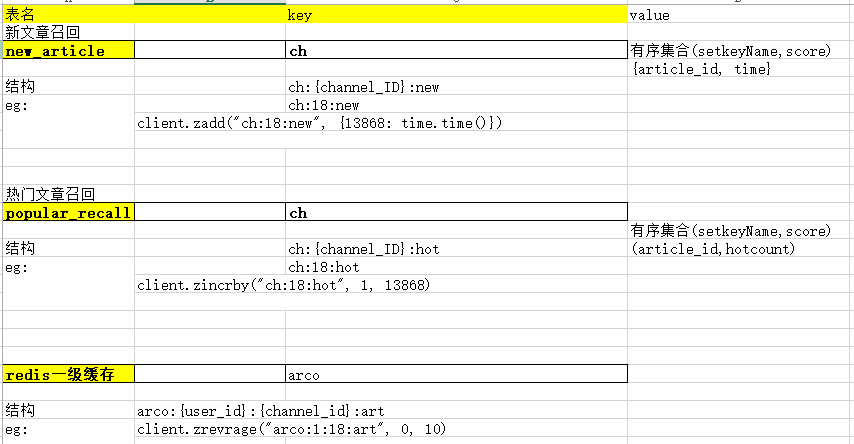

# 黑马头条推荐系统
## 推荐系统通常被设计为三个阶段：召回、排序和调整

## 推荐系统流程

推荐系统表设计:
[toutiao_project_相关表_001.xlsx](images_attachments/20200513011615809_22641/toutiao_project_相关表_001.xlsx)

用户行为日志文件:"/root/workspace/logs/userClick.log"
格式: {"actionTime":"2019-04-10 21:04:39","readTime":"","channelId":18,"param":{"action": "click", "userId": "2", "articleId": "14299", "algorithmCombine": "C2"}}
	停留时间:read; 点击事件:click; 曝光事件(相当于刷新一次请求推荐新文章):exposure; 收藏事件:collect; 分享事件:share
					
hive.toutiao数据库:

hive.profile数据库:

hive.article数据库:

HBase表

redis表:

用户画像:
整理用户基础行为表'user_action' --得到--> user_article_basic

